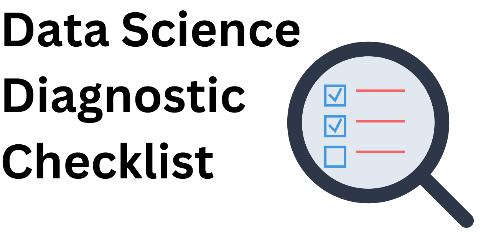

## Help! My **Model** is **_worse_** on the **Test Set** than the **Train Set**

This problem is typically referred to as the "_**generalization gap**_", "_**train-test gap**_", or simply as "_**overfitting**_", where performance of a final chosen model on the hold out test set is worse than on the train set.

We can use diagnostic tests to systematically probe the data and the model in order to gather evidence about the unknown underlying cause of a performance mismatch. We probably cannot _know_ anything for sure, but we can build a case and then take action in response. You will eventually have to make a judgement call.

**Scope**: Machine learning and deep learning predictive modeling for regression and classification tasks.

Let's walk through some categories of checklists of questions we can use to learn more.

Home: <https://github.com/Jason2Brownlee/DataScienceDiagnosticChecklist>

## Table of Contents

1. [Problem Definition](#problem-definition)
2. [Train/Test Split Procedure](#traintest-split-procedure)
3. [Data Preparation Leakage](#data-preparation-leakage)
4. [Quantify the Performance Gap](#quantify-the-performance-gap)
5. [Challenge the Performance Gap](#challenge-the-performance-gap)
6. [Data Distribution Checks](#data-distribution-checks)
7. [Performance Distribution Checks](#performance-distribution-checks)
8. [Residual Error Checks](#residual-error-checks)
9. [Residual Error Distribution Checks](#residual-error-distribution-checks)
10. [Overfitting Train Set Checks](#overfitting-train-set-checks)
11. [Overfitting Test Harness Checks](#overfitting-test-harness-checks)
12. [Overfitting Test Set Checks](#overfitting-test-set-checks)
13. [Model Robustness/Stability Checks](#model-robustnessstability-checks)
14. [So Now What? Action Steps](#so-now-what-action-steps)
15. [Frequently Asked Questions](#frequently-asked-questions)
16. [Glossary of Terms](#glossary-of-terms)
17. [Disclaimer](#disclaimer)
18. [About](#about)

## Problem Definition

Let's define our terms and the problem we are having (also see the [glossary](#glossary-of-terms)).

1. A **dataset** is collected from the domain and split into a **train set** used for model selection and a **test set** used for the evaluation for the chosen model.
2. A **test harness** is used to evaluate many candidate models on the **train set** by estimating their generalized performance (e.g. a subsequent train/test split, k-fold cross-validation, etc.).
3. A single **chosen model** is (eventually) selected using an estimate of its generalized performance on the **test harness** (here, "model" refers to the pipeline of data transforms, model architecture, model hyperparameters, calibration of predictions, etc.).
3. The chosen **model** is then fit on the entire **train set** and evaluated on the **test set** to give a single unbiased point estimate of generalized performance.
4. The difference between 1) the **test harness** model performance on the **train set** and 2) the point estimation of the model fit on the **train set** and evaluated on the **test set** _do not match_. **Why?**

Variations on this problem:

1. Performance on the **test harness** and **test set** appropriately match, but performance on a **hold out set** is worse.
2. Performance on the **test harness** and **test set** appropriately match, but performance on **data in production** is worse.

## Train/Test Split Procedure

* _Is there evidence that the split of the dataset into train/test subsets followed best practices?_

### Procedure

1. Did you remove duplicates from the dataset before splitting into train and test sets?
2. Did you shuffle the dataset when you split into train and test sets?
3. Did you stratify the split by class label (only classification tasks)?
4. Did you stratify the split by domain entities? (only data with domain entities that have more than one example, e.g one customer with many transactions, one user with many recommendations, etc.)?
5. Are the train/test sets disjoint (e.g. non-overlapping, do you need to confirm this)?
6. Did you use a typical split ratio (e.g. 70/30, 80/20, 90/10)?
7. Did you use a library function to perform the split (e.g. `sklearn.model_selection.train_test_split`)?
8. Did you document the split procedure (e.g. number of duplicates removed, split percentage, random number seed, reasons, etc.)?
9. Did you save the original dataset, train set, and test set in separate files?

Related:

1. Did you receive train/test sets already split (do they have separate sources)?
2. Did a stakeholder withhold the test/validation set?
3. Did you remove unambiguously irrelevant features (e.g. database id, last updated datetime, etc.)?
4. According to domain experts, are samples from the dataset i.i.d (e.g. no known spatial/temporal/group dependence, concept/distribution shifts, sample bias, etc.)?

### Sensitivity Analysis

If you have the luxury of time and compute, perform a sensitivity analysis of split sizes (e.g. between 50/50 to 99/1 with some linear interval) and optimize for one or more target properties of stability like data distribution and/or model performance.

#### Split vs Distribution Sensitivity
Compare data distributions of train/test sets and find the point where they diverge.

**Warning**: To avoid leakage, do not review summary statistics of the data directly, only the output and interpretation of the statistical tests.

1. Compare the correlations of each input/target variable (e.g. Pearson's or Spearman's).
2. Compare the central tendencies for each input/target variable (e.g. t-Test or Mann-Whitney U Test).
3. Compare the distributions for each input/target variable (e.g. Kolmogorov-Smirnov Test or Anderson-Darling Test).
4. Compare the variance for each input/target variable (e.g. F-test, Levene's test).

#### Split vs Performance Sensitivity
Compare the distributions of standard un-tuned machine learning model performance scores on train/test sets and find the point where they diverge.

**Warning**: To avoid leakage, do not review performance scores directly, only the output and interpretation of the statistical tests.

1. Compare the correlations of model performance scores (e.g. Pearson's or Spearman's).
2. Compare the central tendencies of model performance scores (e.g. t-Test or Mann-Whitney U Test).
3. Compare the distributions of model performance scores (e.g. Kolmogorov-Smirnov Test or Anderson-Darling Test).
4. Compare the variance of model performance scores (e.g. F-test, Levene's test).

## Data Preparation Leakage

* _Is there evidence that knowledge from the test set leaked to the train set during data preparation?_

Any data cleaning (beyond removing duplicates), preparation, or analysis like tasks performed on the whole dataset (prior to splitting) may result in leakage from the test set to the train set and a potential optimistic bias.

This bias is typically not discovered until the model is employed on entirely new data or deployed to production.

1. Did you perform data scaling on the whole dataset prior to the split (e.g. standardization, normalization, etc.)?
2. Did you perform data transforms on the whole dataset prior to the split (e.g. power transform, log transform, etc.)?
3. Did you impute missing values on the whole dataset prior to the split (e.g. mean/median impute, knn impute, etc.)?
4. Did you engineer new features on the whole dataset prior to the split (e.g. one hot encode, integer encode, etc.)?
5. Did you perform exploratory data analysis (EDA) on the whole dataset prior to the split (e.g. statistical summaries, plotting, etc.)?

## Quantify the Performance Gap

There is variance in the model (e.g. random seed, training data) and variance in its performance (e.g. test data). Vary these elements and see if the distributions overlap or not. If they do, any gap might be statistical noise. If they don't, it might be a real issue that requires more digging.

* _Is there empirical evidence that the performance gap between the test harness and the test set is a concern (warrants further investigation)?_

**Warning**: To avoid leakage, do not review performance scores directly, only the output and interpretation of the statistical tests.

1. Are you optimizing one (and only one) performance metric for the task?
2. What are the specific performance scores on the test harness and test set.
	1. Include mean and standard deviation for test harness scores if a resampling method like k-fold cross-validation was used.
3. What is the absolute difference in scores between the test harness and test set?
4. Does the chosen model outperform a dummy/naive model (e.g. predict mean/median/mode etc.) on the test harness and test set (e.g. does it have any skill)?
5. Are you able to evaluate a diverse suite of many (e.g. 10+) untuned standard machine learning models on the training and test sets and calculate their generalization gap (absolute difference) in order to give a reference distribution for comparison?
	1. Is the chosen model generalization gap within the confidence interval of the standard model gaps?
	2. Is the chosen model generalization gap within the standard error of the standard model gaps?
6. Are you able to evaluate the single chosen model many times (e.g. 30+, 100-1000) on bootstrap samples of the test set?
	1. Is the train performance within the confidence interval of performance on the test set?
	2. Is the train performance within the standard error of performance on the test set?
7. Are you able to develop multiple estimates of model performance on the training dataset (e.g. k-fold cross-validation, repeated train/test splits, bootstrap, checkpoint models, etc.)?
	1. Is the test set performance within the confidence interval of the performance estimate from the train set?
	2. Is the test set performance within the standard error of the performance estimate from the train set?
8. Are you able to fit multiple different versions of the chosen model on the training dataset (e.g. with different random seeds, related to model robustness tests below)?
	1. Are performance scores highly correlated?
	2. Do the performance scores on train and test sets have the same central tendencies (e.g. t-Test or Mann-Whitney U Test)?
	3. Do the performance scores on train and test sets have the same distributions (e.g. Kolmogorov-Smirnov Test or Anderson-Darling Test)?
	4. Do the performance scores on train and test sets have the same variance (e.g. F-test, Levene's test)?

## Challenge the Performance Gap

Often the train set score on the test harness is a mean (e.g. via k-fold cross-validation) and the test set score is a point estimate. Perhaps comparing these different types of quantities is the source of the problem.

We change the model evaluation scheme in one or both cases so that we can attempt an apples-to-apples comparison of model performance on the train and test sets.

* _Is there statistical evidence that the chosen model has the same apples-to-apples performance on the train and test sets?_

### Prerequisite
We require a single test harness that we can use to evaluate the single chosen model on the train set and the test set that results in multiple (>3) estimates of model performance on hold out data.

* Did you use a train/test split for model selection on the test harness?
	* Perform multiple (e.g. 5 or 10) train/test splits on the train set and the test set and gather the two samples of performance scores.
* Did you use k-fold cross-validation for model selection (e.g. kfold, stratified kfold, repeated kfold, etc.) in your test harness?
	* Apply the same cross-validation evaluation procedure to the train set and the test set and gather the two samples of performance scores.
* Is performing multiple fits of the chosen model too expensive and you used one train/val split on the train set?
	* Evaluate the same chosen model on many (e.g. 30, 100, 1000) bootstrap samples of the validation set and the test set and gather the two samples of performance scores.

### Checks
We now have a sample of performance scores on the train set and another for the test set.

Next, compare the distributions of these performance scores.

**Warning**: To avoid leakage, do not review performance scores directly, only the output and interpretation of the statistical tests.

1. Are performance scores highly correlated (e.g. Pearson's or Spearman's)?
2. Do the performance scores on train and test sets have the same central tendencies (e.g. t-Test or Mann-Whitney U Test)?
3. Do the performance scores on train and test sets have the same distributions (e.g. Kolmogorov-Smirnov Test or Anderson-Darling Test)?
4. Do the performance scores on train and test sets have the same variance (e.g. F-test, Levene's test)?
5. Is the effect size of the difference in performance between the train and test scores small (e.g. Cohen's d)?
6. Do performance score points on a scatter plot fall on the expected diagonal line (or close enough to it)?

## Data Distribution Checks

We assume that the train set and the test set are a representative statistical sample from the domain. As such, they should have the same data distributions.

* _Is there statistical evidence that the train and test sets have the same data distributions?_

**Warning**: To avoid leakage, do not review summary statistics of the data directly, only the output and interpretation of the statistical tests.

These checks are most useful if train and test sets had separate sources or we suspect a sampling bias of some kind.

1. Do numerical input/target variables have the same central tendencies (e.g. t-Test or Mann-Whitney U Test)?
2. Do numerical input/target variables have the same distributions (e.g. Kolmogorov-Smirnov Test or Anderson-Darling Test)?
3. Do categorical input/target variables have the same distributions (e.g. Chi-Square Test)?
4. Are pair-wise correlations between numerical input variable distributions consistent (e.g. Pearson's or Spearman's, threshold difference, Fisher's z-test, etc.)?
5. Are pair-wise correlations between numerical input and target variable distributions consistent?
6. Do numerical input/target variables in the train and test sets have a similar distributions of univariate outliers (e.g. 1.5xIQR, 3xstdev, etc.)?
7. Do the train and test sets have a similar pattern of missing values?

Extensions:

* Compare the train set and the test set to the whole dataset (train+test).
* Compare the train set and the test set to a new data sample (if available).

## Performance Distribution Checks

We assume model performance on the train set and test set generalizes to new data. As such, model performance on the train and test sets have the same distribution.

* _Is there statistical evidence that general model performance on the train and test sets have the same distributions?_

### Prerequisite
We require a single test harness that we can use to evaluate a suite of standard models on the train set and the test set that results in multiple (>3) estimates of model performance on hold out data.

1. Choose a diverse suite (10+) of standard machine learning algorithms with good default hyperparameters that appropriate for your predictive modeling task (e.g. DummyModel, SVM, KNN, DecisionTree, Linear, NeuralNet, etc.)
2. Choose a standard test harness:
	* Did you use a train/test split for model selection on the test harness?
		* Perform multiple (e.g. 5 or 10) train/test splits on the train set and the test set and gather the two samples of performance scores.
	* Did you use k-fold cross-validation for model selection (e.g. kfold, stratified kfold, repeated kfold, etc.) in your test harness?
		* Apply the same cross-validation evaluation procedure to the train set and the test set and gather the two samples of performance scores.
	* Is performing multiple fits of the chosen model too expensive and you used one train/val split on the train set?
		* Evaluate the same chosen model on many (e.g. 30, 100, 1000) bootstrap samples of the validation set and the test set and gather the two samples of performance scores.
3. Evaluate the suite of algorithms on the train set and test set using the same test harness.
4. Gather the sample of hold out performance scores on the train set and test set for each algorithm.

### Checks
We now have a sample of performance scores on the train set and another for the test set for each algorithm.

Next, compare the distributions of these performance scores (all together or per algorithm or both).

**Warning**: To avoid leakage, do not review performance scores directly, only the output and interpretation of the statistical tests.

1. Are performance scores highly correlated (e.g. Pearson's or Spearman's)?
2. Do the performance scores on train and test sets have the same central tendencies (e.g. t-Test or Mann-Whitney U Test)?
3. Do the performance scores on train and test sets have the same distributions (e.g. Kolmogorov-Smirnov Test or Anderson-Darling Test)?
4. Do the performance scores on train and test sets have the same variance (e.g. F-test, Levene's test)?
5. Is the effect size of the difference in performance between the train and test scores small (e.g. Cohen's d)?
6. Do performance score points on a scatter plot fall on the expected diagonal line?

## Residual Error Checks

We assume the train and test sets have a balanced sample of difficult-to-predict-examples.

* _Is there evidence that examples in the train set and test set are equally challenging to predict?_

1. Are there examples in the train set or the test set that are always predicted incorrectly?
2. Are there domain segments of the train set or the test set that the are harder to predict than other segments?
3. Are there some classes that are more challenging to predict than others on the train or test sets (classification only)?
4. Are there deciles of the target variable that are more challenging to predict than others on the train or test sets (regression only)?

## Residual Error Distribution Checks

We assume model prediction errors on the train set and test set are statistically representative of errors we will encounter on new data. As such, residual errors on the train set have the same distribution as the test set.

* _Is there evidence that model prediction errors on the train set and test set have the same distributions?_

### Prerequisite
We require a single test harness that we can use to evaluate a suite of standard models on the train set and the test set that results in a modest sample of prediction errors.

1. Choose a diverse suite (10+) of standard machine learning algorithms with good default hyperparameters that appropriate for your predictive modeling task (e.g. DummyModel, SVM, KNN, DecisionTree, Linear, NeuralNet, etc.)
2. Choose a standard test harness:
	* Did you use a train/test split for model selection on the test harness?
		* Perform multiple (e.g. 5 or 10) train/test splits on the train set and the test set and gather the two samples of performance scores.
	* Did you use k-fold cross-validation for model selection (e.g. kfold, stratified kfold, repeated kfold, etc.) in your test harness?
		* Apply the same cross-validation evaluation procedure to the train set and the test set and gather the two samples of performance scores.
	* Is performing multiple fits of the chosen model too expensive and you used one train/val split on the train set?
		* Evaluate the same chosen model on many (e.g. 30, 100, 1000) bootstrap samples of the validation set and the test set and gather the two samples of performance scores.
3. Evaluate the suite of algorithms on the train set and test set using the same test harness.
4. Gather the sample of prediction errors on the hold out data for the train set and test set for each algorithm.

### Checks
We now have a sample of prediction errors on the train set and another for the test set for each algorithm.

Next, compare the distributions of these errors (all together, or per algorithm, or both).

For regression tasks and classification tasks that require probabilities:

1. Are residual errors highly correlated (e.g. Pearson's or Spearman's)?
2. Do the residual errors on train and test sets have the same central tendencies (e.g. t-Test or Mann-Whitney U Test)?
3. Do the residual errors on train and test sets have the same distributions (e.g. Kolmogorov-Smirnov Test or Anderson-Darling Test)?
4. Do the residual errors on train and test sets have the same variance (e.g. F-test, Levene's test)?
5. Is the effect size of the difference in residual errors between the train and test scores small (e.g. Cohen's d)?
6. Do residual errors points on a scatter plot fall on the expected diagonal line?

For classification tasks that require a nominal class label:

1. Do the confusion matrices of predictions from the train and test sets have the same distributions (e.g. Chi-Squared Test)?

## Overfitting Train Set Checks

We assume that model performance on train data generalizes to new data. As such, model performance on the train and hold out data in the test harness should have the same distribution.

Significantly better model performance on train data compared to performance on hold out data (e.g. validation data or test folds) may indicate overfitting.

* _Is there evidence that the chosen model has overfit the train data compared to hold out data in the test harness?_

### Performance Distribution Tests

* Are you able to evaluate the chosen model using resampling (e.g. k-fold cross-validation)?

Evaluate the model and gather performance scores on train and test folds.

1. Are performance scores on train and test folds highly correlated (e.g. Pearson's or Spearman's)?
2. Do performance scores on train and test folds have the same central tendencies (e.g. paired t-Test or Wilcoxon signed-rank test)?
3. Do performance scores on train and test folds have the same distributions (e.g. Kolmogorov-Smirnov Test or Anderson-Darling Test)?
4. Do performance score points on a scatter plot fall on the expected diagonal line?

### Loss Curve Tests

* Are you able to evaluate the model after each training update (aka training epoch, model update, boosting round, etc.)?

Split the training dataset into train/validation sets and evaluate the model loss on each set after each model update.

1. Does a line plot of model loss show signs of overfitting (improving/level performance on train, improving then worsening performance on validation i.e., the so-called "U" shape of a loss plot)?

### Validation Curve Tests

* Are you able to vary model capacity?

Vary model capacity and evaluate model performance with each configuration value and record train and hold out performance.

Note where the currently chosen configuration (if any) should be included.

1. Does a line plot of capacity vs performance scores show signs of overfitting for the chosen configuration relative to other configurations?

### Learning Curve Tests

Vary the size of the training data and evaluate model performance.

Note whether the model performance scales, e.g. performance improves with more data.

1. Does the line plot of train set size vs train and validation performance scores show signs of overfitting (or does performance scale proportionally to dataset size)?

### Visualize The Fit

In some cases we can visualize the domain and the model fit in the domain (possible in only the simplest domains).

Visualizing the fit relative to the data can often reveal the condition of the fit, e.g. good fit, underfit, overfit.

1. Visualize the decision surface for the model (classification only).
2. Visualize a scatter plot for data and line plot for the fit (regression only).

## Overfitting Test Harness Checks

A model has overfit the test harness if the performance of the model on the hold out set in the test harness (test folds in cross-validation or validation set) is better than performance when a new model is fit on the entire train set and evaluated on the test set.

* _Is there evidence that the chosen model has overfit the train set (whole test harness) compared to the test set?_

This is the premise for the entire checklist, go back to the top and work your way down.

Specifically focus on:

1. Train/Test Split Procedure
2. Data Distribution Checks
3. Performance Distribution Checks

## Overfitting Test Set Checks

A model has overfit the test set if a model is trained on the entire train set and evaluated on the test set and its performance is better than performance of a new model fit on the whole dataset (train + test sets) and evaluated on new data (e.g. in production).

* _Is there evidence that the chosen model has overfit the test set?_

This can happen if the test set is evaluated and knowledge is used in the test harness in some way, such as: choosing a model, model configuration, data preparation, etc.

This is called test set leakage and results in an optimistic estimate of model performance.

## Model Robustness/Stability Checks

Perhaps we can describe the robustness or stability of a model as how much its performance varies under noise.

A model that is sensitive to noise or small perturbations might be overly optimized to its training dataset and in turn fragile to a change in data, i.e., overfit.

We assume that small changes to the model and data result in proportionally small changes to model performance on the test harness.

* _Is there evidence that the model is robust to perturbations?_

1. Is the variance in model performance small when the chosen model is evaluated with differing random seeds for the learning algorithm?
2. Is the variance in model performance modest when Gaussian noise is added to input features?
3. Is the variance in model performance modest when Gaussian noise is added to target variable (regression only)?
4. Is the variance in model performance modest when class labels are flipped in target variable (classification only)?
5. Is the variance in model performance modest when Gaussian noise is added to key model hyperparameters?

### Sensitivity Analysis

1. Perform a sensitivity analysis of noise perturbation tests and confirm that model performance degrades gracefully (perhaps proportionality) to the amount of noise added to the dataset.

## So Now What? Interventions

So, there may be an issue with your test set or your model. Now what do we do?

### 1. Do Nothing

Take the estimate of model performance on the test set as the expected behavior of the model on new data.

If test set performance is to be presented to stakeholders, don't present a point estimate.

* Estimate performance using many (30+) bootstrap samples of the test set and report the median and 95% confidence interval.

### 2. Fix the Test Harness

In most cases, the fix involves making the test harness results less biased (avoid overfitting) and more stable/robust (more performance sampling).

1. Use k-fold cross-validation, if you're not already.
2. Use 10 folds instead of 5 or 3, if you can afford the computational cost.
3. Use repeated 10-fold cross-validation, if you can afford the computational cost.
4. Use a pipeline of data cleaning, transforms, feature engineering, etc. steps that are applied automatically.
	- The pipeline steps must be fit on train data (same data used to fit a candidate/final model) and applied to all data before it touches the model.
	- See [`sklearn.pipeline.Pipeline`](https://scikit-learn.org/1.5/modules/generated/sklearn.pipeline.Pipeline.html)
5. Use nested k-fold cross-validation or nested train/validation split to tune model hyperparameters for a chosen model.

### 3. Fix Overfitting Generally

Even with best practices, high-capacity models can overfit.

This is a big topic, but to get started, consider:

1. **Simplification**: Reducing model complexity by using fewer layers/parameters, removing features, or choosing a simpler model architecture, etc. This limits the model's capacity to memorize training data and forces it to learn more generalizable patterns instead.
2. **Regularization**: Adding penalty terms to the loss function that discourage complex models by penalizing large weights. Common approaches include L1 (Lasso) and L2 (Ridge) regularization, which help prevent the model from relying too heavily on any single feature.
3. **Early Stopping**: Monitoring model performance on a validation set during training and stopping when performance begins to degrade. This prevents the model from continuing to fit noise in the training data after it has learned the true underlying patterns.
4. **Data Augmentation**: Artificially increasing the size and diversity of the training dataset by applying transformations or adding noise to existing samples. This exposes the model to more variation and helps it learn more robust features rather than overfitting to specific training examples.

Beyond these simple measures: dive into the literature for your domain and for your model and sniff out common/helpful regularization techniques you can test.

### 4. Fix the Test Set

Perhaps the test set is large enough and data/performance distributions match well enough, but there are specific examples that are causing problems.

* Perhaps some examples are outliers (cannot be predicted effectively) and should be removed from the train and test sets?
* Perhaps a specific subset of the test set can be used (careful of selection bias)?
* Perhaps the distribution of challenging examples is not balanced across train/test sets and domain-specific stratification of the dataset into train/test sets is required?
* Perhaps a weighting can be applied to samples and a sample-weighting aware learning algorithm can be used?
* Perhaps you can augment the test set with artificial/updated/contrived examples (danger)?

**Warning**: Purists will hate this, for good reason. There is a slippery slope of removing all the hard-to-predict examples or too many examples. You're intentionally biasing the data and manipulating the results. Your decisions need to be defensible.

### 5. Get a New Test Set

Perhaps the test set is too small (high variance of results) or the data/performance distributions are different or one of many reasons above.

* Discard the test set, gather a new test set and develop a new unbiased estimate of the model's generalized performance.

Sometimes this is not possible, in which case:

* Combine train and test set into the whole dataset again and develop a new split using best practices above
	* Ideally use a sensitivity analysis to ensure to choose an optimal split/avoid the same problem.

**Warning**: Purists will hate this too, for good reason. There is a risk of an optimistic bias with this approach as you already know something about what does/doesn't work on examples in the original test set.

## Frequently Asked Questions

**Q. Do I need to perform all of these checks?**

No. Use the checks that are appropriate for your project. For example, checks that use k-fold cross-validation may not be appropriate for a deep learning model that takes days/weeks to fit. Use your judgement.

**Q. Is this overkill?**

Yeah, probably. You often catch major issues with a quick data and performance distribution comparison of the train/test sets.

**Q. Don't I risk test set leakage and overfitting if I evaluate a model on the test set more than once?**

Yes. Strictly, the test set must be discarded after being used once. You can choose to bend this rule at your own risk. If you use these checks at the beginning of a project and carefully avoid and omit any summary stats/plots of data and model performance on the test set (e.g. only report the outcomes of statistical tests), then I suspect the risk is minimal.

**Q. Do you have code snippets or examples of the statistical tests?**

Yes, tons. Email me and I can send something through. If there's enough demand, I'll put something more comprehensive together. Maybe a lib or a mini site of examples.

**Q. Do all of these checks help?**

No. There is a lot of redundancy across the categories and the checks. This is a good thing as it gives many different perspectives on evidence gathering and more opportunities that we will catch the cause of the fault. Also, the specific aspects of some projects make some avenues of checking available and some not.

**Q. Don't we always expect a generalization gap?**

Perhaps. But how do you know the gap you see is reasonable for your specific predictive modeling task and test harness?

**Q. Doesn't R/scikit-learn/LLMs/XGBoost/AGI/etc. solve this for me?**

No.

**Q. Does this really matter?**

Perhaps. It comes down to a judgement call, like most things.

**Q. Do you do this on your own projects?**

Yeah, a lot of it. I want to be able to (metaphorically) stand tall, put my hand on my heart, and testify that the test set results on it are as correct and indicative of real world performance as I know how to make them.

**Q. Why do we sometimes use a paired t-Test and sometimes not (and Mann-Whitney U Test vs Wilcoxon signed-rank test)**

When comparing distribution central tendencies on train vs test folds under k-fold cross-validation, we use a paired statistical hypothesis test like the paired Student's t-Test or the Wilcoxon signed-rank test because the train/test folds are naturally dependent upon each other. If we do not account for this dependence, we would miss-estimate the significance. When the two data distributions are independent, we can use an independent test such as the (unpaired) Student's t-Test or the Mann-Whitney U Test.

**Q. What about measure of model complexity to help diagnose overfitting (e.g. AIC/BIC/MDL/etc.)?**

I've not had much luck with these measures in practice. Also, classical ideas of overfitting were focused on "overparameterization". I'm not convinced this is entirely relevant with modern machine learning and deep learning models. We often overparameterize and still achieve SOTA performance. Put another way: Overfitting != Overparameterization. That being said, regularizing away from large magnitude coefficients/weights remains a good practice when overfit.

**Q. Help! The test results are ambiguous. What do I do?**

This is the case more often than not. Don't panic, here are some ideas:
- Can you vary the test harness in some way in order to increase the size of the statistical sample (e.g. k=10 in cross-valuation, repeated cross-validation, bootstrap samples, etc.)?
- Can you perform a sensitivity analysis for the test and see if there is a point of transition?
- Can you try a different but related test to see if it provides less ambiguous results?
- Can you try a completely different test type to see if it gives a stronger signal?

**Q. Help! All checks suggest my test set is no good. What do I do?**

Good, we learned something about the project! Apply the same test to alternate splits of the data (ideally, a sensitivity analysis of many different split sizes) and compare the results. Do they improve? Typically there is a split size that defines a transition point between stable statistical tests/performance and unstable results.

## Glossary of Terms

Let's ensure we're talking about the same things:

* **Chosen Model**: A Chosen Model is the specific machine learning algorithm or architecture selected as the final candidate for solving a particular problem after comparing different options during the model selection phase.
* **Dataset**: A Dataset is a structured collection of data samples, where each sample contains features (input variables) and typically a target variable (for supervised learning), used to train and evaluate machine learning models.
* **Generalization Gap**: The Generalization Gap is the mathematical difference between a model's performance metrics on the training data versus previously unseen test data, indicating how well the model generalizes to new examples.
* **Leakage**: Leakage occurs when information from outside the training set inappropriately influences the model training process, leading to unrealistically optimistic performance estimates that won't hold in production.
* **Overfit**: Overfit happens when a model learns the training data too precisely, including its noise and peculiarities, resulting in poor generalization to new, unseen data.
* **Performance**: Performance is a quantitative measure of how well a model accomplishes its intended task, typically expressed through metrics like accuracy, precision, recall, or mean squared error.
* **Resampling**: Resampling is a family of statistical methods that involve repeatedly drawing different samples from a dataset to estimate model properties or population parameters, with common approaches including bootstrapping and cross-validation.
* **Test Harness**: A Test Harness is the complete experimental framework that includes data preprocessing, model training, validation procedures, and evaluation metrics used to assess and compare different models systematically.
* **Test Set**: The Test Set is a portion of the dataset that is completely held out during training and only used once at the very end to provide an unbiased evaluation of the final model's performance.
* **Train Set**: The Train Set is the portion of the dataset used to train the model by adjusting its parameters through the optimization of a loss function.
* **Validation Set**: The Validation Set is a portion of the dataset, separate from both training and test sets, used to tune hyperparameters and assess model performance during the development process before final testing.

## Disclaimer

Use these checks, interpret their results, and take resulting action all at your own risk.

I'm trying to help, but I'm not a statistician, merely a humble engineer.

Use your best judgement.

Chat with an LLM, with your data science friend, with your statistician friend and double check your findings, interpretations and resulting actions.

## About

Hi there, I'm Jason Brownlee ([twitter](https://x.com/jason2brownlee), [linkedin](https://www.linkedin.com/in/jasonbrownlee/)), the author of this checklist.

I've been helping data scientists for more than a decade via coaching, consulting, and by authoring 1000+ tutorials and 20+ books on machine learning and deep learning over at Machine Learning Mastery (which I sold in 2021). I've worked in industry, government, startups, and a long time ago, I had more academic aspirations and got a Masters and PhD.

I've helped hundreds (thousands?) of data scientists one-on-one over the years, and the **most common problem is the Generalization Gap** (i.e., performance on new data in the test set or in production is worse than the expected performance from the test harness).

The checklist above is (an updated version of) a diagnostic tool I used to work through the problem with my clients.

I don't do so much consulting anymore, but I know from experience how valuable this checklist can be for those struggling with the generalization gap problem, so I've decided to share it here publicly.

I hope that you find this checklist useful too! If it helps you make progress (or if you have ideas for more/better questions), please email me any time: Jason.Brownlee05@gmail.com

